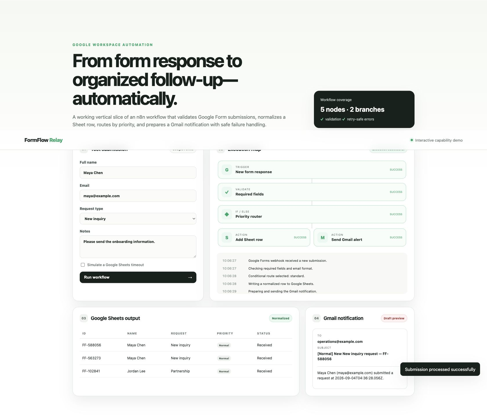
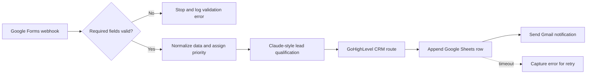

# FormFlow Relay

FormFlow Relay is an application-specific capability demo for an n8n-style AI lead workflow: receive an inbound form, validate and normalize it, qualify intent with deterministic structured output shaped like a Claude node, prepare a GoHighLevel-style CRM update, route the lead, write a Google Sheets row, send a Gmail notification, and expose failures for safe retry.

> This is a capability prototype built with realistic dummy data. It is not presented as previous paid client work and contains no client data or credentials.

**Live demo:** https://formflow-relay-n8n-demo.vercel.app



## Live workflow

The browser demo lets a reviewer:

- submit valid and invalid form data;
- watch each automation node change state;
- confirm that invalid submissions stop before side effects;
- see normalized rows appear in a Sheets-style table;
- inspect the generated Gmail notification;
- simulate a Google Sheets timeout and retry without duplicating the email;
- inspect a Claude-style lead score, intent rationale, route, and simulated GoHighLevel pipeline update.

## Architecture



`workflow.js` contains framework-independent validation, normalization, notification, and failure behavior. `app.js` visualizes the execution. `n8n-workflow.json` provides an importable starter workflow with credential placeholders.

## Run locally

```bash
npm run serve
```

Open `http://localhost:4173`.

## Test

```bash
npm test
```

The tests cover missing fields, malformed email, normalized Sheet rows, priority-aware notifications, and retryable Sheets failures.

## Production setup

1. Import `n8n-workflow.json` into n8n.
2. Add Anthropic/Claude, GoHighLevel, Google Sheets, and Gmail credentials inside n8n—never in source control.
3. Replace the placeholder Sheet ID and recipient.
4. Map the real Google Form response fields.
5. Add an error workflow or alert channel for failed executions.
6. Test with sandbox data, then activate the workflow.

## Error handling and tradeoffs

- Validation happens before Sheets or Gmail to prevent partial writes.
- Gmail runs only after the Sheet append succeeds, preventing notifications for unrecorded submissions.
- The demo intentionally keeps state in the browser; a production workflow relies on n8n execution history and credential storage.
- Google Forms normally writes directly to Sheets. A webhook, Apps Script bridge, or polling trigger can start n8n depending on the client's existing setup and account permissions.
- Real OAuth calls are not made in the public demo so no Google account or private information is exposed.

## Limitations

The public demo simulates Claude, GoHighLevel, and Google services while preserving the workflow rules. Final production activation requires client-owned Anthropic, GoHighLevel, Google, and n8n credentials after contract start.
